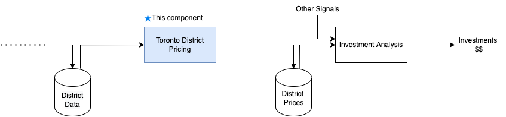

# Toronto Real Estate Investment Analysis

The goal is to predict the median housing price in any district (or constituency) given all the other metrics. The objective here is to feed the model's output, along with other signals into a separate model which will determine whether it is worth investing in a given area or not.

What to type of real estate to analyze?

1. Rental income properties
2. Fix and flip
3. Apartments
4. Commercial Real Estate
5. Partnerships

Model Risk-Reward of Investment oppotunities

**Datasets**

1. Toronto Real Estate Board (TREB) dataset: This dataset includes historical transaction data for properties in the Greater Toronto Area, including sale prices, address, and property characteristics.

2. Canadian Census data: The census provides information on demographic and socio-economic characteristics of the population, which can be used as features in a predictive model.

3. Toronto Open Data: This website provides access to various datasets related to the City of Toronto, including information on property assessments, zoning, and infrastructure.

4. Weather data: Temperature, precipitation, and other weather data can affect housing prices and may be useful features in a predictive model.

5. Google Maps API: This API can be used to extract information about the location of a property, such as distance to amenities and public transportation.

